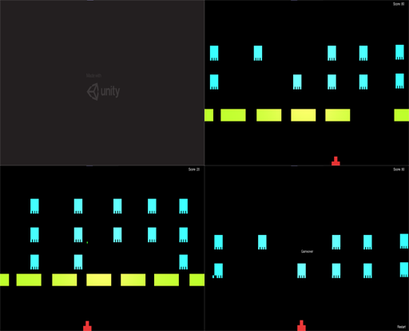

# Space-Invader-2D
A rebuild of the classic Space Invaders game. A Japanese shooting video game released in 1978 by Taito. It was developed by Tomohiro Nishikado, who was inspired by other media: Breakout, The War of the Worlds, and Star Wars

# Link : 
https://drive.google.com/drive/folders/1kkmI7dUK-08nIxRjQriv3vy3fqxgba6U?usp=sharing

* Link contains the game project.
* Video preview of the game.

# Screenshot : 

# Aim
Aim behind this project was to build a working Space Invaders game. This project is made entirely to test the knowledge behind C# scripting.

# System Requirements
* Windows 10 pro
* Unity 2018(LTS),2019(LTS)
* Visual Studios 17 or above
* Core i5 processors 7th gen or above.
* Dedicated GPU (Nvidia or AMD) Recomended.

# Getting Started
Start by downloading the project from given link at the top.
Unity 2018 with (LTS) recomended.

* Visual Studio 2019 or 2019 is recommended, It is made to run on Windows OS (8,10).
* Unity 2018(LTS) is recomended.
* Basics of C# language.
* Knowledge on ray tracing with unity.

# Main features to come:
* A complete game with different set of levels.
* Audio.
